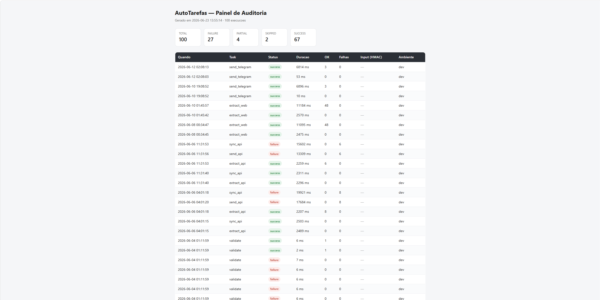

# AutoTarefas

[](https://github.com/paulor007/autotarefas/actions/workflows/ci.yml)
[](https://paulor007.github.io/autotarefas/)
[](https://www.python.org/)
[]()
[](LICENSE)
[]()
[](http://mypy-lang.org/)
[](SECURITY.md)

Robô de automação operacional para tarefas em planilhas (CSV, Excel),
arquivos, sistemas web (RPA) e APIs. Projeto Python moderno com foco em
**segurança**, **rastreabilidade** (audit trail) e **robustez**.

> 🏆 **v1.1.0 — estável + web scraping.** Validador + Backup +
> Organizador + Segurança + Relatórios + RPA Cadastro + Extração via API +
> **Extração via Web Scraping** + Envio via API + Notificações por Email +
> Sincronização API→API, com **CI/CD** (GitHub Actions) e **documentação
> publicada** (GitHub Pages).

📚 **Documentação completa:** <https://paulor007.github.io/autotarefas/>

---

## ✨ Destaques

- **Automação web (RPA)** — cadastra registros web a partir de planilha, com navegador real (Playwright)
- **Extração via API** — consome APIs REST paginadas (com retry e rate limit) e salva em CSV/XLSX/JSON
- **Extração via Web Scraping** — raspa páginas HTML por seletores CSS, segue a paginação e salva em CSV/XLSX/JSON; o modo `--js` renderiza páginas carregadas por JavaScript (Playwright)
- **Envio via API** — cadastro em massa: lê planilha e faz POST de cada linha (retry, rate limit, relatório)
- **Notificações por Email** — envia emails em massa de uma planilha, com template `{coluna}` e senha protegida
- **Notificações por Telegram** — envia mensagens pela Bot API de uma planilha (gratuito), com template `{coluna}` e token protegido
- **Sincronização API→API** — extrai de uma API e envia para outra num passo só (composição de tasks)
- **Sistema demo local** — servidor Flask para testar automações e extrações com segurança
- **Validador de planilhas** com schema declarativo em YAML
- **Validadores brasileiros**: CPF e CNPJ com algoritmo módulo 11
- **Backup ZIP** com hash SHA-256 e excludes inteligentes
- **Organizador de arquivos** com regras YAML
- **Relatórios consolidados** do audit trail (summary/list/errors)
- **Dashboard de auditoria** — painel HTML visual das execuções, gerado localmente (v1.4.0)
- **Segurança transversal documentada** — 13 princípios, threat model
- **Audit trail completo** — toda execução em SQLite append-only com HMAC-SHA256
- **Mascaramento automático** — CPFs, CNPJs, senhas e tokens nunca vazam em logs nem em screenshots
- **Dry-run em tudo** — simula operações antes de fazer mudanças reais
- **Integração contínua** — CI no GitHub Actions (Python 3.12 e 3.13)
- **Type-safe** — mypy strict, 0 erros
- **1229 testes**, 92% de cobertura

---

## 🚀 Instalação

```bash
git clone https://github.com/paulor007/autotarefas.git
cd autotarefas

python -m venv venv
source venv/bin/activate         # Linux/Mac
# .\venv\Scripts\Activate.ps1    # Windows PowerShell

pip install -e ".[dev]"
```

**Pré-requisitos**: Python 3.12+, Git.

### Extras opcionais

```bash
pip install -e ".[rpa]"          # automação web (Playwright)
playwright install chromium      # baixa o navegador (~200MB)

pip install -e ".[demo]"         # servidor demo local (Flask + SMTP)
pip install -e ".[docs]"         # documentação (MkDocs Material)

pip install -e ".[dev,rpa,demo,docs]"  # tudo junto
```

---

## 🎯 Quick Start

```bash
autotarefas init                  # Inicializa ~/.autotarefas/
autotarefas info                  # Verifica o sistema
autotarefas --help                # Lista comandos
autotarefas report                # Vê o que você já fez!
```

---

## 📋 Validador de Planilhas (v0.2.0)

Valida planilhas CSV/Excel contra schemas YAML declarativos.

```bash
autotarefas validate dados.csv --schema schema.yaml \
    --report-json rel.json --report-csv rel.csv
```

Validações: tipo, intervalo, regex, enum, CPF, CNPJ.

---

## 💾 Backup de Arquivos (v0.3.0)

Compacta arquivos/pastas em ZIP com hash SHA-256 para integridade.

```bash
autotarefas backup D:\projeto --output backup.zip \
    --exclude "*.log"
```

---

## 🗂️ Organizador de Arquivos (v0.3.0)

Organiza arquivos em sub-pastas conforme regras declarativas em YAML.

```bash
autotarefas --dry-run organize D:\Downloads --rules rules.yaml
autotarefas organize D:\Downloads --rules rules.yaml
```

Variáveis no destination: `{year}`, `{month:02d}`, `{day:02d}`, `{ext}`.

---

## 🤖 Automação Web — RPA (v0.5.0)

Automatiza cadastros web a partir de uma planilha, usando um navegador
real (Chromium via Playwright). Valida CPF localmente, é tolerante a
falhas por linha e mascara dados sensíveis em screenshots.

### Instalação

```bash
pip install -e ".[rpa]"
playwright install chromium
```

### Uso

```bash
autotarefas rpa cadastro --planilha clientes.csv --site http://localhost:5555
```

### Exemplo de saída

```
============================================================
 RPA Cadastro
============================================================
Planilha: clientes.csv
Site:     http://localhost:5555
Modo:     headless

Processando...

[1/3] Ana Silva Santos    ... [OK] ID: 1
[2/3] Bruno Costa Lima    ... [OK] ID: 2
[3/3] Carlos Pereira      ... [SKIP] CPF invalido (modulo 11)

============================================================
Total:    3 linhas processadas
Sucesso:  2 cadastros realizados
Skipped:  1 linhas puladas
Erros:    0
Tempo:    3.4s
============================================================
```

### Esquema da planilha

| Coluna     | Obrigatório | Validação           |
| ---------- | ----------- | ------------------- |
| `nome`     | Sim         | Não vazio           |
| `email`    | Sim         | Não vazio           |
| `cpf`      | Sim         | Algoritmo módulo 11 |
| `telefone` | Não         | —                   |

### Opções

| Flag              | Descrição                                            | Default    |
| ----------------- | ---------------------------------------------------- | ---------- |
| `--planilha, -p`  | Caminho da planilha CSV/XLSX                         | —          |
| `--site, -s`      | URL base do sistema alvo                             | —          |
| `--show-browser`  | Mostra a janela do navegador                         | headless   |
| `--no-screenshot` | Desabilita screenshots automáticas em erro           | habilitado |
| `--allow-remote`  | Permite URLs não-locais (por padrão, só `localhost`) | bloqueado  |

### Comportamento

- **CPF inválido** → linha pulada (`skipped`), não interrompe as demais
- **CPF duplicado** no sistema → linha pulada (`skipped`)
- **Erro técnico** (timeout, etc.) → linha marcada como `error` + screenshot mascarada
- **Servidor offline** → task termina como `skipped` (não tenta nada)

### Dry-run

Simule sem tocar no sistema (não abre navegador):

```bash
autotarefas --dry-run rpa cadastro --planilha clientes.csv --site http://localhost:5555
```

⚠️ Por segurança, a automação só roda contra `localhost`/`127.0.0.1` por
default. Para sistemas reais, use `--allow-remote` (com responsabilidade).

---

## 🔌 Extração via API (v0.6.0)

Consome uma API REST paginada e salva os dados em arquivo. Faz paginação
automática, com retry resiliente e controle de taxa.

### Uso

```bash
autotarefas extract api --url http://localhost:5555/api/clientes --output clientes.csv
```

### Exemplo de saída

```
============================================================
 Extracao via API
============================================================
URL:    http://localhost:5555/api/clientes
Saida:  clientes.csv
Modo:   normal

  Pagina 1/5 ... 10 registros (total: 10)
  Pagina 2/5 ... 10 registros (total: 20)
  Pagina 3/5 ... 10 registros (total: 30)
  Pagina 4/5 ... 10 registros (total: 40)
  Pagina 5/5 ...  7 registros (total: 47)

============================================================
Extraidos 47 registros -> clientes.csv
============================================================
```

### Opções

| Flag            | Descrição                                    | Default |
| --------------- | -------------------------------------------- | ------- |
| `--url, -u`     | Endpoint da API paginada                     | —       |
| `--output, -o`  | Arquivo de saída (.csv/.xlsx/.json)          | —       |
| `--per-page`    | Itens por página a solicitar                 | `50`    |
| `--max-pages`   | Limite de páginas (default: todas)           | —       |
| `--delay`       | Pausa entre páginas em segundos (rate limit) | `0.0`   |
| `--api-key`     | Chave de API (header `X-API-Key`)            | —       |
| `--timeout`     | Timeout por request em segundos              | `30.0`  |
| `--max-retries` | Tentativas por página em erro temporário     | `3`     |

### Recursos

- **Paginação automática** — segue `has_next` até o fim
- **Retry com backoff** — só em erros temporários (timeout, conexão, HTTP 5xx); 4xx não é retentado
- **Rate limiting** — `--delay` entre páginas para não sobrecarregar a API
- **Multi-formato** — a extensão do `--output` decide (CSV/XLSX/JSON)
- **Autenticação** — `--api-key` vai no header (nunca em log/audit)

### Dry-run

```bash
autotarefas --dry-run extract api -u http://localhost:5555/api/clientes -o x.csv
# [dry-run] Extrairia 47 registros em 5 paginas (nao salva)
```

⚠️ Ao usar `--api-key` sobre `http://` externo (sem TLS), o comando avisa
que a chave trafegaria sem criptografia. Prefira `https://`.

### Sistema demo (para testes)

O servidor demo expõe uma API paginada para testar a extração:

```bash
pip install -e ".[demo]"
python -m tools.demo_server          # http://localhost:5555

# Popular com dados fake (PowerShell):
# Invoke-RestMethod -Method Post -Uri "http://localhost:5555/seed?n=47&clear=true"
```

---

## 🕸️ Extração via Web Scraping (v1.1.0)

Raspa páginas HTML que **não** expõem API. Você descreve o que extrair
com seletores CSS; o comando percorre as linhas, segue a paginação e
salva em arquivo — espelhando o `extract api`.

### Uso

```bash
autotarefas extract web --url http://localhost:5555/catalogo --output produtos.csv \
  --row-selector "tr.produto" \
  --field "nome=td.nome" --field "preco=td.preco" \
  --next-selector "a.next"
```

### Exemplo de saída

```
============================================================
 Extracao via Web (scraping)
============================================================
URL:    http://localhost:5555/catalogo
Saida:  produtos.csv
Linhas: tr.produto  (5 campos)
Modo:   normal

  Pagina 1 ... 10 itens (total: 10)
  Pagina 2 ... 10 itens (total: 20)
  Pagina 3 ... 10 itens (total: 30)
  Pagina 4 ... 10 itens (total: 40)
  Pagina 5 ...  8 itens (total: 48)

============================================================
Extraidos 48 itens -> produtos.csv
============================================================
```

### Opções

| Flag                  | Descrição                                               | Default |
| --------------------- | ------------------------------------------------------- | ------- |
| `--url, -u`           | URL da página a raspar                                  | —       |
| `--output, -o`        | Arquivo de saída (.csv/.xlsx/.json)                     | —       |
| `--row-selector, -r`  | Seletor CSS de cada linha (ex: `tr.produto`)            | —       |
| `--field, -f`         | Coluna no formato `coluna=seletor` (repetível)          | —       |
| `--next-selector, -n` | Seletor do link "próxima página"                        | —       |
| `--max-pages`         | Limite de páginas (default: todas)                      | —       |
| `--delay`             | Pausa entre páginas em segundos                         | `0.0`   |
| `--timeout`           | Timeout por request em segundos                         | `30.0`  |
| `--max-retries`       | Tentativas por página em erro temporário                | `3`     |
| `--js`                | Renderiza a página num navegador (Playwright)           | _off_   |
| `--wait-for`          | Seletor CSS a aguardar antes de extrair (só com `--js`) | —       |

### Recursos

- **Seletores declarativos** — `--row-selector` define as linhas; cada `--field coluna=seletor` extrai uma coluna
- **Paginação automática** — segue `--next-selector` (resolve hrefs relativos; proteção anti-loop)
- **Retry com backoff** — só em erros temporários (timeout, conexão, HTTP 5xx); 4xx não é retentado
- **Multi-formato** — CSV/XLSX/JSON pela extensão do `--output`
- **Scraping educado** — User-Agent honesto e `--delay` entre páginas
- **Parser leve** — `html.parser` da stdlib (sem `lxml`)
- **Modo JavaScript (`--js`)** — renderiza a página num navegador headless (Playwright) e extrai o HTML após o JS; ideal para conteúdo via AJAX/SPA (requer `playwright install chromium`)

### Dry-run

```bash
autotarefas --dry-run extract web -u http://localhost:5555/catalogo -o x.csv \
  -r "tr.produto" -f "nome=td.nome" -n "a.next"
# [dry-run] Extrairia ~10 itens na 1a pagina (tem proxima: sim)
```

### Modo JavaScript (`--js`)

Para páginas cujo conteúdo é carregado por JavaScript (AJAX/SPA), o modo
`--js` usa um navegador headless (Playwright) para renderizar a página e
extrair o HTML **depois** que o script roda. O `--wait-for` aguarda um
seletor aparecer (sem pausas fixas):

```bash
autotarefas extract web -u http://localhost:5555/catalogo-js -o produtos.csv \
  -r "tr.produto" -f "nome=td.nome" -f "preco=td.preco" \
  --js --wait-for "tr.produto"
```

Requer o navegador instalado (`playwright install chromium`). O modo padrão
(sem `--js`) continua usando httpx — rápido e sem navegador.

### Sistema demo (para testes)

O servidor demo expõe o `/catalogo` (48 produtos paginados) e o
`/catalogo-js` (conteúdo carregado por JavaScript) como alvos:

```bash
python -m tools.demo_server          # /catalogo e /catalogo-js
```

---

## 📤 Envio via API (v0.7.0)

Lê uma planilha e envia cada linha para uma API (POST). É o caminho
profissional para **cadastro em massa** num sistema que exponha API REST
— muito mais rápido que automação via navegador.

### Uso

```bash
autotarefas send api --planilha clientes.csv --url https://sistema.empresa.com/api/clientes --report resultado.csv
```

### Exemplo de saída

```
============================================================
 Envio via API
============================================================
Planilha: clientes.csv
URL:      https://sistema.empresa.com/api/clientes
Modo:     normal

  [1/1000] [OK] criado
  [2/1000] [OK] criado
  [847/1000] [FALHA] HTTP 422: Validacao falhou: email invalido
  ...

============================================================
Total:    1000
Enviados: 998
Falhas:   2
Relatorio: resultado.csv
============================================================
```

### Opções

| Flag             | Descrição                                   | Default |
| ---------------- | ------------------------------------------- | ------- |
| `--planilha, -p` | Planilha CSV/XLSX com os registros          | —       |
| `--url, -u`      | Endpoint da API (recebe POST por linha)     | —       |
| `--api-key`      | Chave de API (header X-API-Key)             | —       |
| `--bearer`       | Token Bearer (Authorization)                | —       |
| `--delay`        | Pausa entre envios em segundos (rate limit) | `0.0`   |
| `--timeout`      | Timeout por request em segundos             | `30.0`  |
| `--max-retries`  | Tentativas por linha em erro temporário     | `3`     |
| `--report, -r`   | Relatório por linha (.csv/.xlsx/.json)      | —       |

### Recursos

- **Tolerância por linha** — uma linha ruim não interrompe as demais
- **Retry inteligente** — só em erros temporários (timeout, 5xx); 4xx (duplicata/validação) não é retentado
- **Rate limiting** — `--delay` entre envios
- **Relatório** — `--report` salva quem foi e quem falhou (e por quê)
- **Autenticação** — `--api-key` e/ou `--bearer`

### Status do envio

- **SUCCESS** — todas as linhas enviadas
- **PARTIAL** — algumas falharam (exit 0, com aviso e relatório)
- **FAILURE** — nenhuma enviada (exit 1)

⚠️ Ao enviar `--api-key`/`--bearer` sobre `http://` externo (sem TLS), o
comando avisa que a credencial trafegaria sem criptografia.

---

## 📧 Notificações por Email (v0.8.0)

Lê uma planilha de destinatários e envia um email **personalizado por
linha**, via SMTP. O assunto e o corpo aceitam `{coluna}`: trechos como
`{nome}` são trocados pelos valores da linha.

### Uso

```bash
autotarefas send email --planilha contatos.csv --smtp-host smtp.gmail.com --smtp-port 587 \
  --from voce@empresa.com --subject "Olá {nome}!" --body-file corpo.txt --user voce@empresa.com -r resultado.csv
```

### Segurança da senha 🔐

A senha SMTP **nunca** é passada na linha de comando. Ela vem de:

1. variável de ambiente `AUTOTAREFAS_SMTP_PASSWORD` (ideal para automação), ou
2. um **prompt oculto** (`getpass`) quando você informa `--user`.

Assim a senha não vaza no histórico do shell nem em logs de processo, e
nunca é gravada no audit ou no relatório.

### Opções

| Flag             | Descrição                              | Default |
| ---------------- | -------------------------------------- | ------- |
| `--planilha, -p` | Planilha CSV/XLSX com os destinatários | —       |
| `--smtp-host`    | Servidor SMTP                          | —       |
| `--smtp-port`    | Porta do servidor                      | `587`   |
| `--from`         | Endereço do remetente                  | —       |
| `--subject`      | Assunto (aceita `{coluna}`)            | —       |
| `--body`         | Corpo (aceita `{coluna}`)              | —       |
| `--body-file`    | Arquivo com o corpo (precede `--body`) | —       |
| `--email-column` | Coluna com o email do destinatário     | `email` |
| `--user`         | Usuário SMTP (login)                   | —       |
| `--html`         | Envia o corpo como HTML                | `off`   |
| `--no-tls`       | Desativa STARTTLS (ex: servidor local) | `off`   |
| `--delay`        | Pausa entre envios em segundos         | `0.0`   |
| `--report, -r`   | Relatório por linha (.csv/.xlsx/.json) | —       |

### Recursos

- **Templates** `{coluna}` no assunto e no corpo
- **Tolerância por linha** — um email ruim não interrompe os demais
- **Rate limiting** — `--delay` entre envios
- **Relatório** — `--report` salva o resultado de cada linha (`_resultado`/`_mensagem`)
- **Corpo texto ou HTML** — `--html`
- **dry-run** — mostra o que enviaria, sem conectar

### Servidor SMTP de debug (para testes)

Um servidor SMTP local que recebe os emails sem enviá-los para a
internet — ideal para testar com segurança:

```bash
pip install -e ".[demo]"
python -m tools.smtp_debug          # localhost:8025

# aponte a EmailTask para localhost:8025 com --no-tls
```

Os emails recebidos são mostrados no console e salvos em `.eml`.

---

## 📨 Notificações por Telegram (v1.2.0)

Lê uma planilha e envia uma mensagem **personalizada por linha** via
Telegram (Bot API). O texto aceita `{coluna}`: trechos como `{nome}` são
trocados pelos valores da linha. Gratuito — sem gateway pago.

### Uso

```bash
autotarefas send telegram --planilha contatos.csv --text "Olá {nome}!" \
  --chat-id-column chat_id --parse-mode HTML -r resultado.csv
```

### Segurança do token 🔐

O token do bot **nunca** é passado na linha de comando. Ele vem de:

1. variável de ambiente `AUTOTAREFAS_TELEGRAM_TOKEN` (ideal para automação), ou
2. um **prompt oculto** (`getpass`).

Assim o token não vaza no histórico do shell. Além disso, ele é **redigido
de qualquer mensagem de erro**, e o **texto enviado nunca é persistido** —
nem no relatório, nem no audit.

### Opções

| Flag               | Descrição                                  | Default                    |
| ------------------ | ------------------------------------------ | -------------------------- |
| `--planilha, -p`   | Planilha CSV/XLSX com os dados             | —                          |
| `--text`           | Template da mensagem (aceita `{coluna}`)   | —                          |
| `--text-file`      | Arquivo com o template (precede `--text`)  | —                          |
| `--chat-id`        | Chat de destino fixo                       | —                          |
| `--chat-id-column` | OU a coluna com o `chat_id` de cada linha  | —                          |
| `--parse-mode`     | `MarkdownV2` / `Markdown` / `HTML`         | —                          |
| `--base-url`       | Base da Bot API (use o demo para testar)   | `https://api.telegram.org` |
| `--delay`          | Pausa entre envios em segundos             | `0.0`                      |
| `--timeout`        | Timeout por request em segundos            | `30.0`                     |
| `--max-retries`    | Tentativas por mensagem em erro temporário | `3`                        |
| `--report, -r`     | Relatório por linha (.csv/.xlsx/.json)     | —                          |

Informe **exatamente um** destino: `--chat-id` (fixo) ou `--chat-id-column` (por linha).

### Recursos

- **Templates** `{coluna}` na mensagem
- **Destino flexível** — fixo ou por coluna; `chat_id` normalizado (`111.0` → `111`)
- **Tolerância por linha** — uma mensagem ruim não interrompe as demais
- **Retry resiliente** — só em erros temporários (5xx/timeout)
- **Privacidade** — token redigido em erros; texto enviado não é persistido
- **dry-run** — mostra quantas enviaria + um exemplo (efêmero, não salvo)

### Sistema demo (para testes)

O servidor demo inclui um **mock da Bot API** — teste sem um bot real:

```bash
pip install -e ".[demo]"
python -m tools.demo_server          # http://localhost:5555

# token fake serve; aponte com --base-url http://localhost:5555
autotarefas send telegram -p contatos.csv --text "Oi {nome}!" \
  --chat-id-column chat_id --base-url http://localhost:5555
```

As mensagens recebidas ficam em `GET http://localhost:5555/telegram/mensagens`.

---

## 🔄 Sincronização entre APIs (v1.0.0)

Liga extração e envio num passo só: **extrai de uma API origem e envia
para uma API destino**. É o caso de uso clássico de migração/replicação
de dados entre sistemas que expõem APIs REST.

Arquiteturalmente, a `sync api` **compõe** as tasks de extração e envio
(não reimplementa HTTP nem paginação) — usa um arquivo intermediário
temporário que é descartado ao final.

### Uso

```bash
autotarefas sync api \
  --source-url https://origem.empresa.com/api/clientes \
  --dest-url   https://destino.empresa.com/api/clientes \
  --report resultado.csv
```

### Como funciona

```
sync api  =  extract (origem)  →  [arquivo temporário]  →  send (destino)
```

1. Extrai todos os registros da origem (paginação automática)
2. Envia cada registro ao destino (POST por linha, tolerante a falhas)
3. Agrega o resultado e descarta o arquivo temporário

Se a extração falha, o envio nem começa (curto-circuito). O status final
reflete o envio: **SUCCESS** / **PARTIAL** / **FAILURE**.

### Opções

| Flag               | Descrição                                       | Default |
| ------------------ | ----------------------------------------------- | ------- |
| `--source-url, -s` | API origem (endpoint paginado, para extrair)    | —       |
| `--dest-url, -d`   | API destino (recebe POST por registro)          | —       |
| `--source-api-key` | Chave da API origem (header X-API-Key)          | —       |
| `--dest-api-key`   | Chave da API destino (header X-API-Key)         | —       |
| `--dest-bearer`    | Token Bearer da API destino                     | —       |
| `--per-page`       | Itens por página na extração                    | `50`    |
| `--max-pages`      | Limite de páginas (default: todas)              | —       |
| `--delay`          | Pausa entre páginas e entre envios (rate limit) | `0.0`   |
| `--timeout`        | Timeout por request em segundos                 | `30.0`  |
| `--max-retries`    | Tentativas por página/linha em erro temporário  | `3`     |
| `--report, -r`     | Relatório por linha do envio (.csv/.xlsx/.json) | —       |
| `--format`         | Formato do arquivo intermediário (`csv`/`xlsx`) | `csv`   |

### Dry-run

```bash
autotarefas --dry-run sync api -s URL_ORIGEM -d URL_DESTINO
# [dry-run] Origem testada; sincronizacao nao executada.
```

---

## 📊 Relatórios Consolidados (v0.4.0)

Consulta o **audit trail** e gera estatísticas, listas ou apenas falhas.
Toda execução de qualquer comando é registrada automaticamente em
SQLite, e o `report` te dá visibilidade sobre tudo.

### Uso básico

```bash
# Summary das últimas 24h (default)
autotarefas report

# Última semana
autotarefas report --days 7

# Filtros
autotarefas report --task validate --status failure
autotarefas report --since 2026-05-01 --until 2026-05-15

# Tipos diferentes
autotarefas report --type list                   # lista detalhada
autotarefas report --type errors                 # só falhas

# Formatos diferentes
autotarefas report --format json
autotarefas report --format csv --output rel.csv
```

### Exemplo de saída (summary)

```
============================================================
 AutoTarefas - Relatorio Audit Trail
============================================================

Periodo:  2026-05-21 14:30  ->  2026-05-22 14:30
Total:    47 execucoes

Por task:
  - validate     23 ( 49.0%)  22 ok, 1 falha
  - backup        8 ( 17.0%)  8 ok
  - extract_api   6 ( 12.8%)  6 ok
  - rpa_cadastro  5 ( 10.6%)  4 ok, 1 partial
  - init          5 ( 10.6%)  5 ok

Por status:
  - success      44 ( 93.6%)
  - failure       2 (  4.3%)
  - dry_run       1 (  2.1%)

Duracao media por task:
  - rpa_cadastro 6.80s
  - extract_api  2.10s
  - organize     1.20s
  - backup        550ms
  - validate     150ms

Falhas recentes (ultimas 5):
  X 2026-05-22 13:45  organize  path traversal bloqueado
  X 2026-05-22 09:12  validate  MissingColumnsError: 'idade'...
```

### Opções

| Flag                  | Descrição                     | Default   |
| --------------------- | ----------------------------- | --------- |
| `--task, -t NAME`     | Filtra por task               | —         |
| `--status, -s STATUS` | Filtra por status             | —         |
| `--days N`            | Últimos N dias                | `1` (24h) |
| `--since DATE`        | Data inicial (`YYYY-MM-DD`)   | —         |
| `--until DATE`        | Data final                    | —         |
| `--type`              | `summary` / `list` / `errors` | `summary` |
| `--format`            | `table` / `json` / `csv`      | `table`   |
| `--output, -o PATH`   | Salva em arquivo              | stdout    |
| `--limit N`           | Max linhas em list/errors     | `100`     |

---

## 📊 Dashboard de Auditoria (v1.4.0)

Um **painel HTML** do audit trail: as mesmas execuções do `report`, agora
visuais. O comando lê o histórico, gera uma página **estática e autocontida**
(sem servidor, sem dependência extra) e pode abri-la no navegador.



### Uso

```bash
# Gera dashboard.html no diretório atual
autotarefas dashboard

# Caminho de saída customizado (cria as pastas)
autotarefas dashboard --output relatorios/audit.html

# Gera e abre no navegador
autotarefas dashboard --open

# Filtros (mesma semântica do report)
autotarefas dashboard --task validate --status failure --limit 50
```

### O que mostra

- **Resumo** em cards: total de execuções e contagem por status.
- **Tabela** de execuções: quando, task, status, duração, linhas OK/falhas,
  indicação do `input_hash` (HMAC) e ambiente.
- Todo valor dinâmico é **escapado** (sem HTML injection); dados sensíveis
  nunca aparecem — apenas o hash do input.

### Opções

| Flag                  | Descrição                                 | Default          |
| --------------------- | ----------------------------------------- | ---------------- |
| `--output, -o PATH`   | Arquivo HTML de saída                     | `dashboard.html` |
| `--task, -t NAME`     | Filtra por task                           | —                |
| `--status, -s STATUS` | Filtra por status                         | —                |
| `--limit N`           | Máximo de execuções incluídas             | `100`            |
| `--open`              | Abre o arquivo gerado no navegador padrão | desligado        |

---

## 🛡️ Segurança (v0.4.0)

Este projeto adere a **13 princípios documentados** de segurança.
Consulte [SECURITY.md](SECURITY.md) para detalhes completos.

### Highlights

- **Audit trail imutável** (append-only, HMAC-SHA256)
- **Defense in depth** — múltiplas camadas independentes
- **Whitelist > blacklist** em extensões e paths
- **Validação de filename** em 7 camadas (anti `../../etc`, NUL, nomes
  reservados Windows, chars proibidos)
- **RPA restrito a hosts locais** — automação contra sistema real exige
  `--allow-remote` explícito (fail-safe default)
- **Mascaramento em screenshots** — CPF, CNPJ, senha, token e cartão são
  cobertos automaticamente em capturas de tela
- **Credenciais protegidas** — chaves de API vão só no header (nunca em
  log/audit); senha de email via env/prompt; aviso ao enviá-las sobre
  `http://` externo
- **HTTPS obrigatório em produção**
- **Mascaramento automático** de dados sensíveis em logs e audit
- **Dry-run em operações destrutivas**

### Reportar vulnerabilidades

Veja [SECURITY.md](SECURITY.md) para o processo de **coordinated
disclosure**. Não abra issues públicas para questões de segurança.

---

## 📚 Documentação

Documentação completa em **MkDocs Material**, publicada no GitHub Pages:

👉 **<https://paulor007.github.io/autotarefas/>**

Inclui guia de comandos, visão de arquitetura e uma **referência de API
gerada automaticamente das docstrings** (via `mkdocstrings`).

Para rodar localmente:

```bash
pip install -e ".[docs]"
mkdocs serve          # http://127.0.0.1:8000
```

---

## 📋 Outros Comandos

```bash
autotarefas info        # mostra info do sistema
autotarefas init        # cria estrutura ~/.autotarefas/
autotarefas validate    # valida planilha CSV/Excel
autotarefas backup      # compacta arquivos em ZIP
autotarefas organize    # organiza arquivos em pastas
autotarefas report      # relatórios do audit trail
autotarefas rpa         # automação web (rpa cadastro)
autotarefas extract     # extração via API (extract api) e web scraping (extract web)
autotarefas send        # envio via API (send api) e email (send email)
autotarefas sync        # sincronização API->API (sync api)
```

### Opções globais

| Flag            | Descrição                       |
| --------------- | ------------------------------- |
| `--verbose, -v` | Aumenta verbosidade             |
| `--quiet, -q`   | Diminui verbosidade             |
| `--dry-run`     | Simula sem fazer mudanças reais |
| `--yes, -y`     | Assume "sim" em confirmações    |
| `--version`     | Mostra a versão                 |
| `--help, -h`    | Mostra ajuda                    |

---

## 🛣️ Roadmap

- ✅ **v0.1.0** — Core + CLI base
- ✅ **v0.2.0** — Validador de planilhas
- ✅ **v0.3.0** — Backup + Organizador
- ✅ **v0.4.0** — Segurança Transversal + Relatórios
- ✅ **v0.5.0** — Sistema demo + RPA Cadastro Web
- ✅ **v0.6.0** — Extração via API
- ✅ **v0.7.0** — Envio via API (cadastro em massa)
- ✅ **v0.8.0** — Notificações por Email
- ✅ **v1.0.0** — Versão estável: CI/CD + documentação + sincronização API→API
- ✅ **v1.1.0** — Web scraping (`extract web`)
- ✅ **v1.2.0** — Notificações por Telegram
- ✅ **v1.3.0** — Extração com JavaScript (`extract web --js`)
- ✅ **v1.4.0** — Dashboard de auditoria (`autotarefas dashboard`) _(atual)_
- ⏳ **futuro** — Paginação por clique em SPAs no modo `--js`

---

## 🧑‍💻 Desenvolvimento

```bash
pip install -e ".[dev]"
pre-commit install

ruff check .
ruff format .
mypy src/
bandit -c pyproject.toml -r src
pytest                    # testes + cobertura (mínimo 85%)
pre-commit run --all-files
```

O **CI** (GitHub Actions) roda esses mesmos passos em Python 3.12 e 3.13
a cada push e pull request.

### Stack

- **Python 3.12+**
- **Click** + **Rich** — CLI moderna
- **pydantic-settings** — config type-safe
- **loguru** — logging com mascaramento
- **SQLite** — audit trail local
- **pandas** + **openpyxl** + **PyYAML** — planilhas, schemas e output da extração
- **zipfile** + **hashlib** + **shutil** — backup/organizador (stdlib!)
- **Playwright** — automação web (RPA)
- **Flask** — servidor demo local (desenvolvimento)
- **httpx** — requests HTTP (extração, envio e sincronização via API)
- **BeautifulSoup** — parsing de HTML (web scraping; parser `html.parser` da stdlib)
- **tenacity** — retry com backoff exponencial
- **smtplib** + **email** — envio de emails (stdlib!)
- **aiosmtpd** — servidor SMTP de debug (desenvolvimento)
- **MkDocs Material** + **mkdocstrings** — documentação
- **pytest** + **mypy strict** + **ruff** + **bandit** + **detect-secrets** — qualidade
- **GitHub Actions** — CI/CD (testes, lint, tipos, segurança) e deploy das docs

---

## 📄 Licença

[MIT](LICENSE) © 2026 Paulo Lavarini
