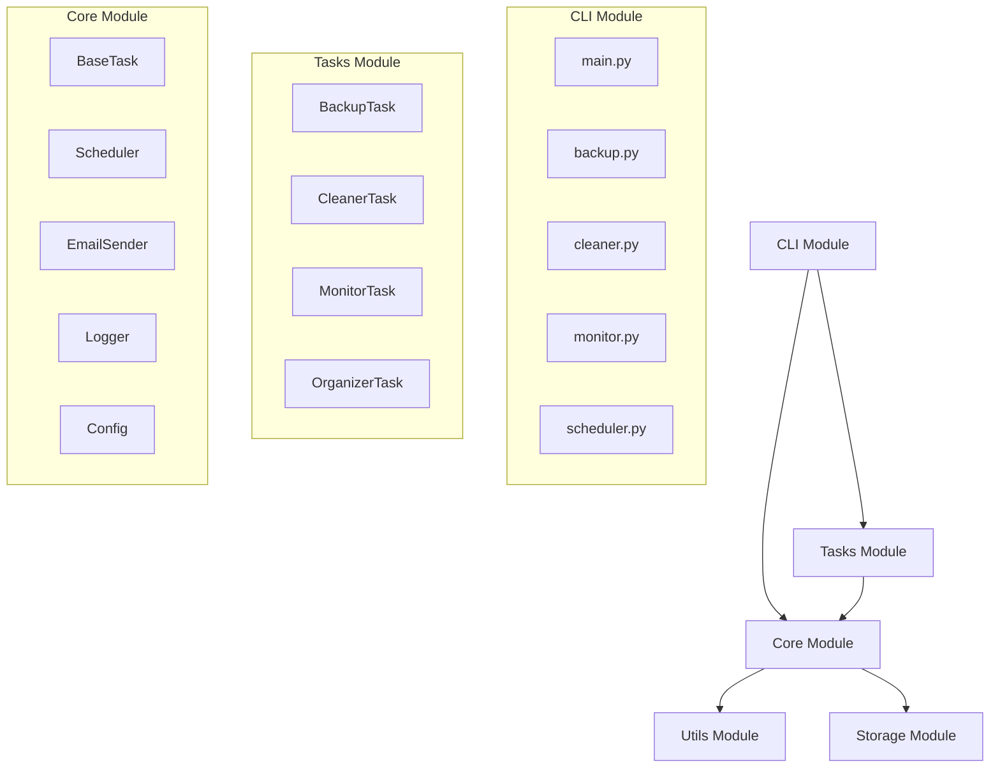
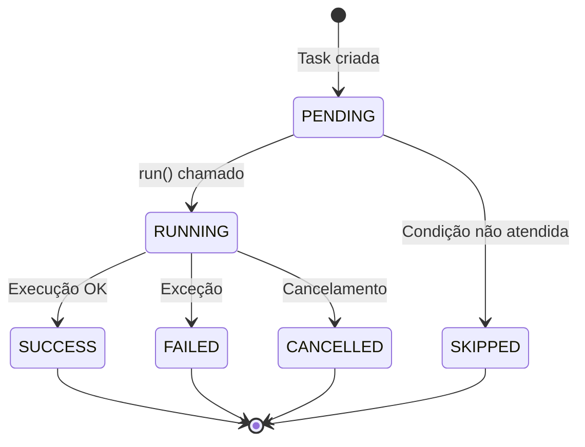

# 🏗️ Arquitetura do Sistema - AutoTarefas

**Versão:** 1.0
**Data:** Dezembro 2025
**Status:** Aprovado

---

## 1. Visão Geral

### 1.1 Estilo Arquitetural

O AutoTarefas segue uma **Arquitetura em Camadas (Layered Architecture)** combinada com **Arquitetura Modular**, onde cada funcionalidade é encapsulada em módulos independentes que se comunicam através de interfaces bem definidas.

### 1.2 Princípios de Design

| Princípio | Aplicação |
|-----------|-----------|
| **Separação de Responsabilidades** | Cada módulo tem uma única responsabilidade |
| **Inversão de Dependência** | Módulos dependem de abstrações (BaseTask) |
| **Composição sobre Herança** | Tasks são compostas, não herdadas em cadeia |
| **Fail-Safe** | Operações destrutivas exigem confirmação |
| **Configuração Externa** | Parâmetros em .env e config files |

---

## 2. Diagrama de Camadas

```
┌─────────────────────────────────────────────────────────────────────┐
│                         CAMADA DE APRESENTAÇÃO                       │
│  ┌─────────────────────────────────────────────────────────────┐    │
│  │                         CLI (Click)                          │    │
│  │  ┌─────────┐ ┌─────────┐ ┌─────────┐ ┌─────────┐ ┌────────┐ │    │
│  │  │ backup  │ │ clean   │ │ monitor │ │schedule │ │ email  │ │    │
│  │  └─────────┘ └─────────┘ └─────────┘ └─────────┘ └────────┘ │    │
│  │  ┌─────────┐ ┌─────────┐ ┌─────────┐                        │    │
│  │  │organize │ │ report  │ │  init   │                        │    │
│  │  └─────────┘ └─────────┘ └─────────┘                        │    │
│  └─────────────────────────────────────────────────────────────┘    │
│                              Rich (UI)                               │
└─────────────────────────────────────────────────────────────────────┘
                                   │
                                   ▼
┌─────────────────────────────────────────────────────────────────────┐
│                         CAMADA DE NEGÓCIO                            │
│  ┌──────────────────────────────────────────────────────────────┐   │
│  │                          TASKS                                │   │
│  │  ┌────────────┐ ┌────────────┐ ┌────────────┐ ┌────────────┐ │   │
│  │  │ BackupTask │ │CleanerTask │ │MonitorTask │ │OrganizerTask│ │   │
│  │  └────────────┘ └────────────┘ └────────────┘ └────────────┘ │   │
│  │  ┌────────────┐ ┌────────────┐                               │   │
│  │  │ReporterTask│ │SalesReport │                               │   │
│  │  └────────────┘ └────────────┘                               │   │
│  └──────────────────────────────────────────────────────────────┘   │
└─────────────────────────────────────────────────────────────────────┘
                                   │
                                   ▼
┌─────────────────────────────────────────────────────────────────────┐
│                           CAMADA CORE                                │
│  ┌─────────────┐ ┌─────────────┐ ┌─────────────┐ ┌─────────────┐    │
│  │  BaseTask   │ │  Scheduler  │ │   Email     │ │  Notifier   │    │
│  │ TaskResult  │ │ TaskRegistry│ │ EmailSender │ │             │    │
│  │ TaskStatus  │ │ ScheduledJob│ │ EmailMsg    │ │             │    │
│  └─────────────┘ └─────────────┘ └─────────────┘ └─────────────┘    │
│  ┌─────────────┐ ┌─────────────┐ ┌─────────────┐                    │
│  │   Logger    │ │   Config    │ │   Storage   │                    │
│  │  (Loguru)   │ │  (Settings) │ │  JobStore   │                    │
│  │             │ │             │ │ RunHistory  │                    │
│  └─────────────┘ └─────────────┘ └─────────────┘                    │
└─────────────────────────────────────────────────────────────────────┘
                                   │
                                   ▼
┌─────────────────────────────────────────────────────────────────────┐
│                        CAMADA DE UTILITÁRIOS                         │
│  ┌─────────────────────────────────────────────────────────────┐    │
│  │                        utils/helpers.py                      │    │
│  │  • format_size()      • ensure_dir()      • safe_path()     │    │
│  │  • human_time()       • hash_file()       • is_safe_path()  │    │
│  └─────────────────────────────────────────────────────────────┘    │
└─────────────────────────────────────────────────────────────────────┘
                                   │
                                   ▼
┌─────────────────────────────────────────────────────────────────────┐
│                       CAMADA DE INFRAESTRUTURA                       │
│  ┌───────────┐ ┌───────────┐ ┌───────────┐ ┌───────────┐           │
│  │ Sistema   │ │   SMTP    │ │  SQLite/  │ │  Sistema  │           │
│  │ Arquivos  │ │  Server   │ │   JSON    │ │Operacional│           │
│  └───────────┘ └───────────┘ └───────────┘ └───────────┘           │
└─────────────────────────────────────────────────────────────────────┘
```

---

## 3. Diagrama de Componentes

```
┌─────────────────────────────────────────────────────────────────────────────┐
│                                 AutoTarefas                                  │
│                                                                             │
│  ┌─────────────────────────────────────────────────────────────────────┐   │
│  │                              CLI Module                               │   │
│  │                                                                       │   │
│  │   main.py ──────┬──────────────────────────────────────────────┐     │   │
│  │                 │                                              │     │   │
│  │        ┌────────┴────────┐                                     │     │   │
│  │        ▼                 ▼                                     ▼     │   │
│  │   commands/         commands/                             commands/  │   │
│  │   backup.py         cleaner.py    ...more...              email.py   │   │
│  └─────────────────────────────────────────────────────────────────────┘   │
│           │                 │                                     │         │
│           ▼                 ▼                                     ▼         │
│  ┌─────────────────────────────────────────────────────────────────────┐   │
│  │                            Tasks Module                              │   │
│  │                                                                       │   │
│  │  ┌─────────────┐  ┌─────────────┐  ┌─────────────┐  ┌─────────────┐ │   │
│  │  │   backup    │  │   cleaner   │  │   monitor   │  │  organizer  │ │   │
│  │  │   .py       │  │   .py       │  │   .py       │  │   .py       │ │   │
│  │  │             │  │             │  │             │  │             │ │   │
│  │  │• BackupTask │  │• CleanerTask│  │• MonitorTask│  │• Organizer  │ │   │
│  │  │• RestoreTask│  │• Profiles   │  │• Metrics    │  │  Task       │ │   │
│  │  │• Manager    │  │• Reporter   │  │• History    │  │• UndoTask   │ │   │
│  │  │• Compress   │  │• TrashMgr   │  │• Dashboard  │  │• Journal    │ │   │
│  │  └──────┬──────┘  └──────┬──────┘  └──────┬──────┘  └──────┬──────┘ │   │
│  └─────────┼────────────────┼────────────────┼────────────────┼────────┘   │
│            │                │                │                │             │
│            └────────────────┴────────┬───────┴────────────────┘             │
│                                      │                                       │
│                                      ▼                                       │
│  ┌─────────────────────────────────────────────────────────────────────┐   │
│  │                             Core Module                              │   │
│  │                                                                       │   │
│  │  ┌─────────────┐  ┌─────────────┐  ┌─────────────┐  ┌─────────────┐ │   │
│  │  │   base.py   │  │ scheduler.py│  │  email.py   │  │ notifier.py │ │   │
│  │  │             │  │             │  │             │  │             │ │   │
│  │  │ • BaseTask  │  │ • Scheduler │  │ • EmailMsg  │  │ • Notifier  │ │   │
│  │  │ • TaskResult│  │ • Registry  │  │ • Sender    │  │ • Templates │ │   │
│  │  │ • TaskStatus│  │ • Job       │  │ • Priority  │  │             │ │   │
│  │  └─────────────┘  └──────┬──────┘  └─────────────┘  └─────────────┘ │   │
│  │                          │                                           │   │
│  │                          ▼                                           │   │
│  │                   ┌─────────────┐                                    │   │
│  │                   │  storage/   │                                    │   │
│  │                   │             │                                    │   │
│  │                   │ • JobStore  │                                    │   │
│  │                   │ • RunHistory│                                    │   │
│  │                   └─────────────┘                                    │   │
│  │                                                                       │   │
│  │  ┌─────────────┐  ┌─────────────┐                                   │   │
│  │  │  logger.py  │  │  config.py  │                                   │   │
│  │  │  (Loguru)   │  │  (Settings) │                                   │   │
│  │  └─────────────┘  └─────────────┘                                   │   │
│  └─────────────────────────────────────────────────────────────────────┘   │
│                                                                             │
└─────────────────────────────────────────────────────────────────────────────┘
```

---

## 4. Diagrama de Classes (Core)

```
┌─────────────────────────────────────────────────────────────────────────────┐
│                              CLASSES ABSTRATAS                               │
└─────────────────────────────────────────────────────────────────────────────┘

    ┌─────────────────────────────────┐
    │          <<abstract>>           │
    │           BaseTask              │
    ├─────────────────────────────────┤
    │ + name: str                     │
    │ + description: str              │
    │ + config: dict                  │
    ├─────────────────────────────────┤
    │ + run() -> TaskResult           │  ←── Abstract method
    │ + validate() -> bool            │
    │ + on_success(result)            │
    │ + on_failure(error)             │
    └───────────────┬─────────────────┘
                    │
                    │ extends
        ┌───────────┼───────────┬───────────────┬───────────────┐
        ▼           ▼           ▼               ▼               ▼
┌─────────────┐ ┌─────────┐ ┌─────────────┐ ┌─────────────┐ ┌─────────────┐
│ BackupTask  │ │Cleaner  │ │ MonitorTask │ │OrganizerTask│ │ReporterTask │
│             │ │  Task   │ │             │ │             │ │             │
├─────────────┤ ├─────────┤ ├─────────────┤ ├─────────────┤ ├─────────────┤
│+ source     │ │+ targets│ │+ interval   │ │+ source_dir │ │+ template   │
│+ dest       │ │+ profile│ │+ thresholds │ │+ profile    │ │+ data       │
│+ compress   │ │+ dry_run│ │             │ │+ dry_run    │ │             │
├─────────────┤ ├─────────┤ ├─────────────┤ ├─────────────┤ ├─────────────┤
│+ run()      │ │+ run()  │ │+ run()      │ │+ run()      │ │+ run()      │
│+ restore()  │ │+ scan() │ │+ collect()  │ │+ preview()  │ │+ generate() │
└─────────────┘ └─────────┘ └─────────────┘ └─────────────┘ └─────────────┘

┌─────────────────────────────────────────────────────────────────────────────┐
│                              DATA CLASSES                                    │
└─────────────────────────────────────────────────────────────────────────────┘

┌─────────────────────────┐     ┌─────────────────────────┐
│     <<dataclass>>       │     │       <<enum>>          │
│      TaskResult         │     │      TaskStatus         │
├─────────────────────────┤     ├─────────────────────────┤
│ + success: bool         │     │ PENDING                 │
│ + status: TaskStatus    │     │ RUNNING                 │
│ + message: str          │     │ SUCCESS                 │
│ + data: dict            │     │ FAILED                  │
│ + duration: float       │     │ CANCELLED               │
│ + timestamp: datetime   │     │ SKIPPED                 │
└─────────────────────────┘     └─────────────────────────┘

┌─────────────────────────┐     ┌─────────────────────────┐
│     <<dataclass>>       │     │       <<enum>>          │
│     ScheduledJob        │     │     ScheduleType        │
├─────────────────────────┤     ├─────────────────────────┤
│ + id: str               │     │ INTERVAL                │
│ + name: str             │     │ DAILY                   │
│ + task_type: str        │     │ WEEKLY                  │
│ + task_config: dict     │     │ MONTHLY                 │
│ + schedule_type: enum   │     │ CRON                    │
│ + schedule_config: dict │     └─────────────────────────┘
│ + enabled: bool         │
│ + last_run: datetime    │     ┌─────────────────────────┐
│ + next_run: datetime    │     │       <<enum>>          │
│ + run_count: int        │     │       JobStatus         │
└─────────────────────────┘     ├─────────────────────────┤
                                │ ACTIVE                  │
                                │ PAUSED                  │
                                │ DISABLED                │
                                └─────────────────────────┘
```

---

## 5. Fluxo de Execução

### 5.1 Fluxo de Comando CLI

```
┌──────────┐    ┌──────────┐    ┌──────────┐    ┌──────────┐    ┌──────────┐
│  User    │    │   CLI    │    │  Command │    │   Task   │    │  Result  │
│ Terminal │    │  main.py │    │  Handler │    │  Class   │    │  Output  │
└────┬─────┘    └────┬─────┘    └────┬─────┘    └────┬─────┘    └────┬─────┘
     │               │               │               │               │
     │ autotarefas   │               │               │               │
     │ backup run    │               │               │               │
     │ /home/docs    │               │               │               │
     │──────────────>│               │               │               │
     │               │               │               │               │
     │               │ parse args    │               │               │
     │               │──────────────>│               │               │
     │               │               │               │               │
     │               │               │ validate()    │               │
     │               │               │──────────────>│               │
     │               │               │               │               │
     │               │               │ BackupTask()  │               │
     │               │               │──────────────>│               │
     │               │               │               │               │
     │               │               │    run()      │               │
     │               │               │──────────────>│               │
     │               │               │               │               │
     │               │               │               │ TaskResult    │
     │               │               │<──────────────│               │
     │               │               │               │               │
     │               │               │ format output │               │
     │               │               │──────────────────────────────>│
     │               │               │               │               │
     │ ✅ Backup     │               │               │               │
     │ completed     │               │               │               │
     │<──────────────────────────────────────────────────────────────│
     │               │               │               │               │
```

### 5.2 Fluxo do Scheduler

```
┌───────────┐   ┌───────────┐   ┌───────────┐   ┌───────────┐   ┌───────────┐
│ Scheduler │   │  JobStore │   │  Registry │   │   Task    │   │RunHistory │
│   Loop    │   │           │   │           │   │           │   │           │
└─────┬─────┘   └─────┬─────┘   └─────┬─────┘   └─────┬─────┘   └─────┬─────┘
      │               │               │               │               │
      │ load_jobs()   │               │               │               │
      │──────────────>│               │               │               │
      │               │               │               │               │
      │  [jobs]       │               │               │               │
      │<──────────────│               │               │               │
      │               │               │               │               │
      │         ┌─────┴─────┐         │               │               │
      │         │  foreach  │         │               │               │
      │         │   job     │         │               │               │
      │         └─────┬─────┘         │               │               │
      │               │               │               │               │
      │ if job.is_due()               │               │               │
      │               │               │               │               │
      │ get_task(type)│               │               │               │
      │───────────────────────────────>│               │               │
      │               │               │               │               │
      │               │  TaskClass    │               │               │
      │<───────────────────────────────│               │               │
      │               │               │               │               │
      │ task.run(config)              │               │               │
      │───────────────────────────────────────────────>│               │
      │               │               │               │               │
      │               │               │  TaskResult   │               │
      │<───────────────────────────────────────────────│               │
      │               │               │               │               │
      │ save_run(job, result)         │               │               │
      │───────────────────────────────────────────────────────────────>│
      │               │               │               │               │
      │ update_job()  │               │               │               │
      │──────────────>│               │               │               │
      │               │               │               │               │
```

---

## 6. Interfaces e Contratos

### 6.1 Interface BaseTask

```python
from abc import ABC, abstractmethod
from dataclasses import dataclass
from enum import Enum
from typing import Any, Dict, Optional
from datetime import datetime


class TaskStatus(Enum):
    PENDING = "pending"
    RUNNING = "running"
    SUCCESS = "success"
    FAILED = "failed"
    CANCELLED = "cancelled"
    SKIPPED = "skipped"


@dataclass
class TaskResult:
    success: bool
    status: TaskStatus
    message: str
    data: Dict[str, Any] = None
    duration: float = 0.0
    timestamp: datetime = None

    def __post_init__(self):
        if self.timestamp is None:
            self.timestamp = datetime.now()
        if self.data is None:
            self.data = {}


class BaseTask(ABC):
    """Classe base abstrata para todas as tasks."""

    def __init__(self, name: str, description: str = "", **config):
        self.name = name
        self.description = description
        self.config = config
        self._start_time: Optional[datetime] = None

    @abstractmethod
    def run(self) -> TaskResult:
        """Executa a task. Deve ser implementado pelas subclasses."""
        pass

    def validate(self) -> bool:
        """Valida configurações antes da execução."""
        return True

    def on_success(self, result: TaskResult) -> None:
        """Hook chamado após execução bem-sucedida."""
        pass

    def on_failure(self, error: Exception) -> None:
        """Hook chamado após falha na execução."""
        pass
```

### 6.2 Interface Scheduler

```python
from typing import Callable, Dict, List, Optional, Type


class TaskRegistry:
    """Registro central de tipos de tasks disponíveis."""

    _tasks: Dict[str, Type[BaseTask]] = {}

    @classmethod
    def register(cls, name: str) -> Callable:
        """Decorator para registrar uma task."""
        def decorator(task_class: Type[BaseTask]) -> Type[BaseTask]:
            cls._tasks[name] = task_class
            return task_class
        return decorator

    @classmethod
    def get(cls, name: str) -> Optional[Type[BaseTask]]:
        """Retorna a classe da task pelo nome."""
        return cls._tasks.get(name)

    @classmethod
    def list_all(cls) -> List[str]:
        """Lista todos os tipos de tasks registrados."""
        return list(cls._tasks.keys())


class Scheduler:
    """Gerenciador de agendamento de tarefas."""

    def add_job(self, job: ScheduledJob) -> str:
        """Adiciona um novo job ao scheduler."""
        pass

    def remove_job(self, job_id: str) -> bool:
        """Remove um job do scheduler."""
        pass

    def pause_job(self, job_id: str) -> bool:
        """Pausa um job."""
        pass

    def resume_job(self, job_id: str) -> bool:
        """Retoma um job pausado."""
        pass

    def run_job(self, job_id: str) -> TaskResult:
        """Executa um job imediatamente."""
        pass

    def start(self, blocking: bool = True) -> None:
        """Inicia o loop do scheduler."""
        pass

    def stop(self) -> None:
        """Para o scheduler."""
        pass
```

---

## 7. Padrões de Design Utilizados

| Padrão | Onde é Usado | Propósito |
|--------|--------------|-----------|
| **Template Method** | BaseTask.run() | Define esqueleto do algoritmo |
| **Factory** | TaskRegistry.get() | Cria instâncias de tasks |
| **Singleton** | get_scheduler(), get_logger() | Instância única global |
| **Strategy** | CompressionType, CleaningProfiles | Algoritmos intercambiáveis |
| **Observer** | Notifier | Notificação de eventos |
| **Command** | CLI commands | Encapsula requisições |
| **Repository** | JobStore, RunHistory | Abstrai persistência |
| **Decorator** | @TaskRegistry.register | Registro declarativo |

---

## 8. Estrutura de Dados (Persistência)

### 8.1 Jobs (jobs.json)

```json
{
  "version": "1.0",
  "jobs": [
    {
      "id": "job_abc123",
      "name": "backup-diario",
      "task_type": "backup",
      "task_config": {
        "source": "/home/user/docs",
        "dest": "/backups",
        "compress": "zip"
      },
      "schedule_type": "daily",
      "schedule_config": {
        "time": "02:00"
      },
      "enabled": true,
      "created_at": "2024-12-01T10:00:00",
      "last_run": "2024-12-15T02:00:00",
      "next_run": "2024-12-16T02:00:00",
      "run_count": 15,
      "tags": ["backup", "importante"]
    }
  ]
}
```

### 8.2 Histórico de Execuções (run_history.json)

```json
{
  "version": "1.0",
  "runs": [
    {
      "id": "run_xyz789",
      "job_id": "job_abc123",
      "job_name": "backup-diario",
      "started_at": "2024-12-15T02:00:00",
      "finished_at": "2024-12-15T02:05:30",
      "duration": 330.5,
      "status": "success",
      "result": {
        "files_copied": 150,
        "total_size": "2.5 GB",
        "backup_file": "/backups/backup_20241215.zip"
      },
      "error": null
    }
  ]
}
```

### 8.3 Organizer Journal (organize_journal.json)

```json
{
  "version": "1.0",
  "sessions": [
    {
      "id": "org_session_001",
      "timestamp": "2024-12-15T10:30:00",
      "source_dir": "/home/user/Downloads",
      "profile": "default",
      "moves": [
        {
          "from": "/home/user/Downloads/foto.jpg",
          "to": "/home/user/Downloads/Imagens/foto.jpg",
          "size": 2048576
        }
      ],
      "total_files": 25,
      "undone": false
    }
  ]
}
```

---

## 9. Configuração do Sistema

### 9.1 Variáveis de Ambiente (.env)

```bash
# ===== GERAL =====
AUTOTAREFAS_ENV=development
AUTOTAREFAS_DEBUG=false
AUTOTAREFAS_DATA_DIR=~/.autotarefas

# ===== LOGGING =====
AUTOTAREFAS_LOG_LEVEL=INFO
AUTOTAREFAS_LOG_FILE=~/.autotarefas/logs/autotarefas.log
AUTOTAREFAS_LOG_ROTATION=10 MB
AUTOTAREFAS_LOG_RETENTION=30 days

# ===== EMAIL =====
AUTOTAREFAS_SMTP_HOST=smtp.gmail.com
AUTOTAREFAS_SMTP_PORT=587
AUTOTAREFAS_SMTP_USER=
AUTOTAREFAS_SMTP_PASSWORD=
AUTOTAREFAS_SMTP_FROM=
AUTOTAREFAS_SMTP_TLS=true

# ===== BACKUP =====
AUTOTAREFAS_BACKUP_DEFAULT_DEST=~/backups
AUTOTAREFAS_BACKUP_COMPRESSION=zip

# ===== SCHEDULER =====
AUTOTAREFAS_SCHEDULER_TICK=60
AUTOTAREFAS_SCHEDULER_PERSIST=true
```

### 9.2 Config Class

```python
from pathlib import Path
from pydantic_settings import BaseSettings


class Settings(BaseSettings):
    # Geral
    env: str = "development"
    debug: bool = False
    data_dir: Path = Path.home() / ".autotarefas"

    # Logging
    log_level: str = "INFO"
    log_file: Path = None
    log_rotation: str = "10 MB"
    log_retention: str = "30 days"

    # Email
    smtp_host: str = ""
    smtp_port: int = 587
    smtp_user: str = ""
    smtp_password: str = ""
    smtp_from: str = ""
    smtp_tls: bool = True

    # Backup
    backup_default_dest: Path = Path.home() / "backups"
    backup_compression: str = "zip"

    # Scheduler
    scheduler_tick: int = 60
    scheduler_persist: bool = True

    class Config:
        env_prefix = "AUTOTAREFAS_"
        env_file = ".env"
```

---

## 10. Segurança

### 10.1 Validações de Caminho

```python
def is_safe_path(base_path: Path, target_path: Path) -> bool:
    """Previne path traversal attacks."""
    try:
        base = base_path.resolve()
        target = target_path.resolve()
        return str(target).startswith(str(base))
    except (OSError, ValueError):
        return False
```

### 10.2 Sanitização de Logs

```python
SENSITIVE_PATTERNS = [
    r"password[=:]\s*\S+",
    r"api[_-]?key[=:]\s*\S+",
    r"secret[=:]\s*\S+",
    r"token[=:]\s*\S+",
]

def sanitize_log_message(message: str) -> str:
    """Remove dados sensíveis de mensagens de log."""
    for pattern in SENSITIVE_PATTERNS:
        message = re.sub(pattern, "[REDACTED]", message, flags=re.IGNORECASE)
    return message
```

---

## 11. Decisões Arquiteturais (ADRs)

### 11.1 ADR-001: Uso de Click para CLI

**Status:** Aceito
**Contexto:** Precisamos de um framework CLI robusto
**Decisão:** Usar Click em vez de argparse
**Razão:** Click oferece decorators intuitivos, auto-geração de help, e integração com Rich

### 11.2 ADR-002: Persistência em JSON

**Status:** Aceito
**Contexto:** Precisamos persistir jobs e histórico
**Decisão:** Usar JSON para v0.1, com possibilidade de SQLite futuro
**Razão:** JSON é simples, legível, e suficiente para o MVP

### 11.3 ADR-003: Loguru para Logging

**Status:** Aceito
**Contexto:** Sistema de logging flexível
**Decisão:** Usar Loguru em vez de logging padrão
**Razão:** API mais simples, rotação automática, serialização JSON

### 11.4 ADR-004: Tasks como Classes

**Status:** Aceito
**Contexto:** Precisamos de tasks extensíveis e testáveis
**Decisão:** Implementar tasks como classes herdando de BaseTask
**Razão:** Permite herança, polimorfismo, e facilita testes unitários

---

## 12. Diagramas Mermaid (Para Renderização)

### 12.1 Diagrama de Dependências



### 12.2 Ciclo de Vida de uma Task



---

## 13. Histórico de Revisões

| Versão | Data | Autor | Descrição |
|--------|------|-------|-----------|
| 1.0 | Dez/2025 | - | Versão inicial aprovada |

---

*Documento gerado como parte da Fase 0.2 - Arquitetura do Sistema*
